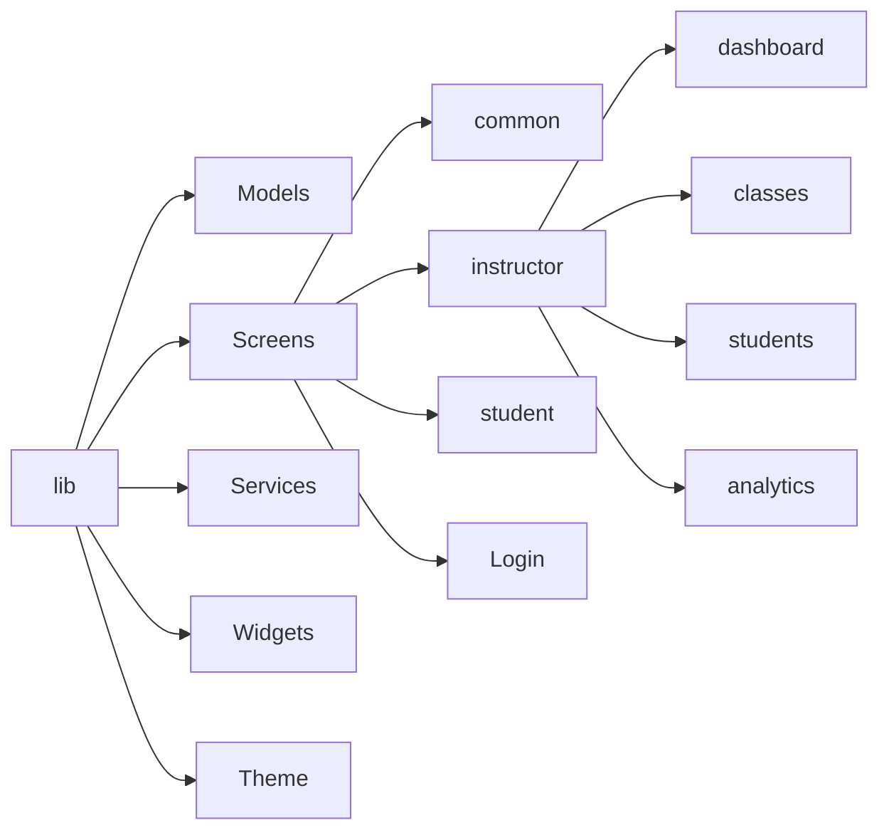

# Arquitectura del Proyecto Plads 2.0

Este diagrama visualiza el flujo principal de la aplicación y la relación entre módulos.

```mermaid
graph TD
    %% --- COLORES ---
    classDef auth fill:#f9f,stroke:#333,stroke-width:2px;
    classDef student fill:#aff,stroke:#333,stroke-width:2px;
    classDef instructor fill:#ffa,stroke:#333,stroke-width:2px;
    classDef service fill:#eee,stroke:#333,stroke-width:4px;

    %% --- SERVICIOS ---
    AuthService[Auth Service]:::service
    Firestore[Firestore DB]:::service
    Storage[Firebase Storage]:::service

    %% --- FLUJO DE INICIO ---
    Start((Inicio App)) --> Switch{AuthWrapper}
    Switch -- "Sin Sesión" --> Login[Login/Register Screen]:::auth
    Switch -- "Rol: Estudiante" --> StudentHome[Student Main Screen]:::student
    Switch -- "Rol: Instructor" --> InstructorHome[Instructor Home Screen]:::instructor
    
    Login -- "Google Sign-In" --> AuthService
    AuthService -- "Get User Data" --> Firestore

    %% --- MÓDULO INSTRUCTOR ---
    subgraph Instructor Flow
        InstructorHome --> Dash[Dashboard Tab]
        InstructorHome --> Classes[Gestión Clases]
        InstructorHome --> Students[Gestión Alumnos]
        InstructorHome --> Analytics[Estadísticas (Responsive)]
        
        Classes --> CreateClass[Crear Clase]
        Classes --> EditClass[Editar Clase]
        
        Students --> StudentDetail[Perfil Alumno]
    end

    %% --- MÓDULO ESTUDIANTE ---
    subgraph Student Flow
        StudentHome --> S_Home[Inicio - Próxima Clase]
        StudentHome --> S_Search[Buscar Clases (Mapa)]
        StudentHome --> S_Agenda[Mis Clases]
        StudentHome --> S_Profile[Perfil y Config]
        
        S_Search --> ClassDetail[Detalle Clase]
        ClassDetail -- "Reservar" --> Firestore
    end

    %% --- CONEXIONES DE DATOS ---
    Dash -.-> |Lee Transacciones| Firestore
    Analytics -.-> |Agrupa Datos| Firestore
    S_Home -.-> |Consulta Inscripciones| Firestore
    CreateClass -.-> |Guarda Datos| Firestore
```

## Estructura de Carpetas


